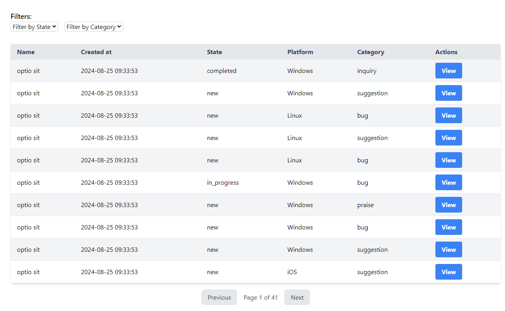
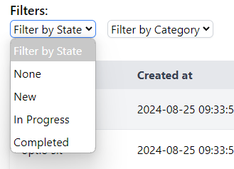
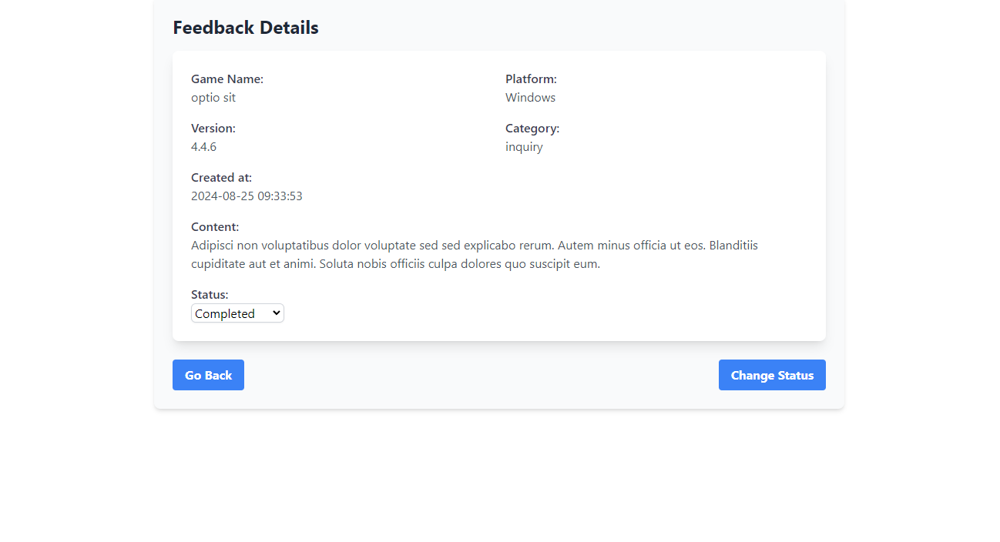
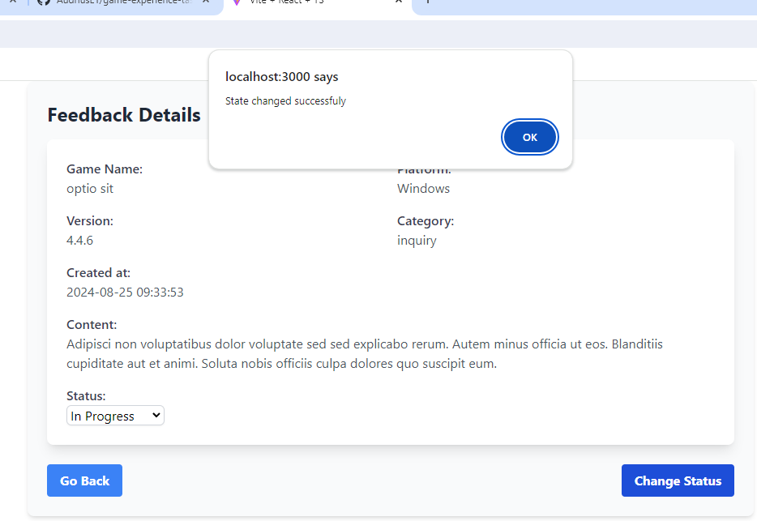
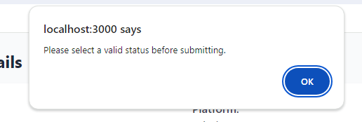

# TutoTOONS Game Feedback Dashboard

## Project Setup Frontend part

### Before you begin please make sure you have the following installed:

- Node.js & npm

### Installation

1. **Clone the repository**

2. **Install Node.js dependencies:**
   ```bash
   npm install
   ```
3. **Set up environment variables:**

   - Copy the `.env.example` to `.env`

4. **Start the frontend server:**
   ```bash
   npm run dev
   ```

## Please note that backend project must be running

### Access feedbacks dashboard at `http://localhost:3000/feedbacks` to view, filter, and update feedback submissions.

### Here is what You should see on `http://localhost:3000/feedbacks` :



### There is filters at the top of the page where You can do some filtering by feedback state or game category (None means that none filter will be applied) :



### By clicking _View_ action You will be navigated to detailed feedback view :



### Here You can select status and apply it by clicking _Change Status_ button. If it is changes successfuly You will receive success message



### And warning if status is not valid


